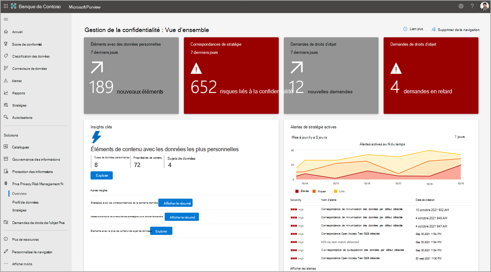

# Rechercher et visualiser des données personnelles dans Microsoft Priva

Microsoft Priva vous aide à comprendre les données stockées par votre organisation en automatisant la découverte des ressources de données personnelles et en fournissant des visualisations d’informations essentielles. Ces visualisations se trouvent dans les pages **de vue d’ensemble** et de **profil de données** . Vous pouvez agir sur les insights ici pour renforcer la posture de confidentialité de votre organisation et réduire les risques.

Pour commencer, accédez à la section Priva du [portail de conformité Microsoft Purview](https://compliance.microsoft.com/) et affichez les pages suivantes :

- **Vue d’ensemble** : fournit une vue d’ensemble des données de votre organisation dans Microsoft 365. Les administrateurs de la confidentialité peuvent surveiller les tendances et les activités, identifier et examiner les risques potentiels liés aux données personnelles, et intégrer des activités clés telles que la gestion des stratégies ou les actions de demande de droits des personnes concernées.
- **Profil de données** : fournit un instantané des données personnelles que votre organisation stocke dans Microsoft 365. Cette page vous aide à visualiser l’endroit où se trouvent les données personnelles, les types les plus répandus dans votre organisation et le nombre de types différents qui existent entre les emplacements de votre environnement Microsoft 365. Vous pouvez également explorer les données personnelles à partir de cet emplacement.

À mesure que vos données changent et que Priva fait de nouvelles découvertes, les informations affichées sur ces pages seront mises à jour. Notez que la représentation des nouvelles données dans les graphiques peut prendre jusqu’à 24 heures.

## Explorer la page vue d’ensemble

La page de vue d’ensemble se compose de trois sections principales. Les vignettes en haut de la page fournissent des statistiques récentes essentielles sur vos données. La section informations clés fournit des opportunités d’investigation sur les tendances et les domaines d’intérêt clés. Pour plus d’informations sur votre environnement de données, consultez les graphiques de courbe de tendance. Pour en savoir plus sur ces domaines, consultez les sections ci-dessous.

### Vignettes principales

#### Correspondances de stratégie au cours des 7 derniers jours

Lorsque des stratégies sont définies dans Priva Privacy Risk Management, vos données sont évaluées en fonction de vos stratégies pour certaines conditions susceptibles de présenter des risques en matière de confidentialité. Les correspondances de stratégie indiquent des découvertes de données qui peuvent nécessiter une révision ou une correction ultérieures. Cette vignette indique le nombre de correspondances de stratégie qui se sont produites au cours des sept derniers jours. Les correspondances s’affichent ici, que les stratégies soient activées ou sont en cours d’exécution en mode test, afin que vous puissiez voir les résultats de toutes vos stratégies actives. Si vous sélectionnez cette vignette, vous accédez à une vue filtrée de la page **Stratégies** de gestion des risques de confidentialité, montrant les stratégies qui ont eu une correspondance au cours des sept derniers jours.

#### Éléments avec des données personnelles

Pour voir les fonctionnalités de découverte automatisée de Priva à l’œuvre, consultez la vignette **Éléments avec données personnelles** . Cette vignette indique le nombre de nouveaux éléments contenant des données personnelles basés sur vos paramètres qui ont été découverts dans l’environnement Microsoft 365 de votre organisation au cours des sept derniers jours. La sélection de cette vignette charge une vue des 100 derniers éléments découverts.

#### Demandes de droits d’objet

La page de vue d’ensemble comprend une vignette qui indique le nombre de demandes de droits d’objet qui ont été créées au cours des sept derniers jours. Une deuxième vignette, le cas échéant, indique le nombre de demandes en retard en fonction de vos échéances désignées et peut nécessiter une attention immédiate. La sélection de ces vignettes permet aux utilisateurs disposant des autorisations appropriées d’accéder à la page de demande de droits d’objet de Priva.

### Insights clés

#### Éléments de contenu avec les données les plus personnelles

Le contenu qui contient une grande quantité de données personnelles peut présenter un risque d’exposition plus élevé. Vous souhaiterez peut-être examiner ces éléments pour vous assurer qu’ils sont couverts par une stratégie de gestion des risques liés à la confidentialité. Pour attirer votre attention sur ces éléments, la page vue d’ensemble fournit une vue d’ensemble de vos éléments de contenu qui contiennent les données les plus personnelles en fonction de vos paramètres. Vous pouvez voir ici le nombre de types de données personnelles uniques détectés, le nombre de propriétaires de contenu uniques identifiés et le nombre de sujets de données identifiés en fonction des paramètres de correspondance des données pour les demandes de droits d’objet.

Sélectionnez **Afficher le résumé** pour une vue récapitulative des éléments trouvés. Vous pouvez également choisir **d’explorer** ces résultats pour afficher un aperçu des fichiers individuels. Cette vue affiche un maximum de 100 éléments. Les utilisateurs du groupe de rôles Gestion de la confidentialité peuvent sélectionner des fichiers pour passer en revue les détails et déterminer la pertinence, et exporter la liste au format .csv pour référence.

#### Stratégies avec le plus de correspondances au cours de la dernière semaine

Cet aperçu présente les stratégies qui ont été mises en correspondance le plus fréquemment au cours des sept derniers jours, que ce soit en mode « Activé » ou « Test ». Il permet d’illustrer les performances de vos stratégies et les effets du travail en cours à mesure que vos utilisateurs Priva affinent leurs comportements de confidentialité.

Sélectionnez **Afficher le résumé** pour un résumé des 10 principales stratégies mises en correspondance et des propriétaires de contenu du contenu associé. Vous verrez également combien de notifications utilisateur ont été envoyées en raison de ces correspondances de stratégie et le nombre d’actions de l’utilisateur effectuées. Sélectionnez **Examiner** pour afficher la page Stratégies dans Gestion des risques liés à la confidentialité, filtrée pour afficher les stratégies à partir de l’affichage récapitulatif. Cette vue d’enquête affiche des statistiques pour toute la durée de vie de la stratégie. Sélectionnez-le pour afficher des détails tels que le moment où les éléments correspondants ont été détectés initialement.

#### Utilisateurs ayant le plus de stratégies mises en correspondance au cours de la dernière semaine

Cet insight traite également des correspondances des stratégies en mode « Test » ou « Activé ». Il vous permet d’afficher un résumé des utilisateurs ayant le plus de correspondances de stratégie au cours de la dernière semaine et des stratégies qu’ils correspondent. Cela inclut les totaux des propriétaires de contenu uniques, les notifications envoyées à ces utilisateurs et le nombre d’actions effectuées à partir de ces notifications. La sélection **d’Examiner** vous permet d’accéder à la page stratégies, filtrée pour afficher les stratégies à partir de l’affichage récapitulatif. Dans la vue d’investigation, vous ne trouverez pas d’informations utilisateur, mais vous pouvez sélectionner une stratégie pour afficher les détails de stratégie liés à ces correspondances.

#### Éléments avec le plus de contenu de sujet de données

Cet insight fait référence aux informations de la fonctionnalité de correspondance de données dans les demandes de droits d’objet et expose les éléments de contenu découverts dans Microsoft 365 qui contiennent le plus de sujets de données. Pour en savoir plus sur ce paramètre, consultez [En savoir plus sur les demandes de droits](subject-rights-requests.md) d’objet.

Ces éléments peuvent vous aider à confirmer votre configuration de correspondance des données et à atténuer les risques de confidentialité liés à ces éléments. Sélectionnez **Afficher le résumé** d’un affichage récapitulatif. Sélectionnez **Explorer** pour obtenir une vue détaillée d’un maximum de 100 de ces éléments. Ici, vous pouvez afficher un aperçu de ces éléments, déterminer la pertinence et exporter la liste au format .csv.

### Graphiques en courbes de tendance

Pour obtenir des visualisations dynamiques des tendances trouvées dans les données de votre organisation, consultez les graphiques de courbe de tendance. Ces graphiques peuvent être filtrés par des caractéristiques telles que les intervalles de temps, le type de données ou les emplacements des données. Utilisez les listes déroulantes fournies pour ajuster votre affichage. Le pointage sur les lignes du graphique vous permet de voir les statistiques relatives à ce point spécifique dans le temps.

Les résultats liés aux stratégies incluent les données des stratégies en mode « Test » et « Activé ». Si aucune stratégie d’un type particulier n’est active, les graphiques associés n’affichent aucun résultat.

#### Alertes de stratégie actives

Cette zone affiche un instantané des alertes actives déclenchées par des correspondances de stratégie. Au fil du temps, cette vue peut vous aider à détecter plus facilement des anomalies telles que de grands pics de volume. Sélectionnez **Afficher les alertes** pour accéder à la page stratégies dans Gestion des risques de confidentialité, où vous pouvez examiner plus en détail les alertes et créer des problèmes de correction.

#### Données personnelles trouvées dans l’organisation

Ce graphique montre les tendances quant à la quantité de données personnelles correspondant à vos paramètres qui ont été découvertes au fil du temps dans votre environnement Microsoft 365 et où elles se trouvent. Il commence à se remplir après l’exécution de Priva pendant suffisamment de temps et une fois que le contenu contenant des données personnelles a été trouvé dans SharePoint, OneDrive, Teams et/ou Exchange.

#### Transferts de données détectés dans l’organisation

Ce graphique est lié aux stratégies de transfert de données. Il fournit une vue de la façon dont les données sont déplacées au sein de votre organisation, soit entre les services, soit entre les régions pour les organisations multigéographiques.

#### Données personnelles inutilisées

Ce graphique est lié aux stratégies de minimisation des données. Il fournit des insights sur la façon dont votre organisation stocke du contenu contenant des données personnelles et comment vos stratégies peuvent améliorer votre gestion de ces données au fil du temps.

#### Données personnelles surexposées

Ce graphique est lié aux stratégies de surexposition des données. Il peut vous aider à identifier les comportements de partage au sein de votre organisation et les emplacements où le contenu avec des données personnelles peut être surexposition, par exemple en étant partagé publiquement, partagé avec un utilisateur externe ou largement partagé au sein de votre organisation.

#### Demandes de droits d’objet par règlement

Cette vue fournit des insights sur les réglementations qui déterminent le plus vos demandes de droits d’objet au fil du temps. La légende de ce graphique montre les noms des réglementations de tendance. Le pointage sur les lignes de tendance affiche les totaux des demandes de droits d’objet ouvertes pour ce règlement pendant l’heure sélectionnée.

#### Demandes de droits d’objet par état

Ce graphique montre comment votre organisation effectue des demandes de droits d’objet, réparties en requêtes **actives**, **fermées** ou **en retard**. Les résultats ici peuvent vous aider à indiquer où vous pourriez tirer parti de l’allocation de plus de ressources pour fermer vos demandes et atteindre les objectifs.

### Vues de données supplémentaires

#### Demandes de droits d’objet en un clin d’œil

Cette vue fournit une vue générale des demandes de droits d’objet actifs, y compris le temps restant pour terminer les demandes selon leurs échéances. Il récapitule le nombre total de demandes que vous avez, le nombre de requêtes actives et le nombre de demandes fermées. Sélectionnez **Afficher toutes les demandes** pour accéder à la page de demande de droits d’objet, où vous pouvez afficher des détails supplémentaires et travailler sur les demandes actives pour les faire progresser jusqu’à leur achèvement.

#### Demandes de droits d’objet par résidence

Cette vue cartographique vous permet de visualiser votre volume de demandes de droits d’objet en fonction de la résidence des personnes concernées. Le pointage sur une bulle permettra d’identifier la région et le nombre total de demandes de droits d’objet ouvertes au nom des résidents.

## Explorer la page de profil de données

La page profil de données de Priva fournit une vue instantanée des données personnelles que votre organisation stocke dans Microsoft 365 et où elle réside. Il fournit également des insights sur les types de données que vous stockez. Les vignettes principales sont les suivantes.

### Instances de type de données personnelles détectées dans Microsoft 365

Cette vignette vous permet de visualiser la quantité de données personnelles présentes dans votre environnement Microsoft 365 en fonction de vos paramètres et de la façon dont ces données sont distribuées entre Exchange, OneDrive, SharePoint et Teams.

Le graphique à barres affiche le nombre approximatif d’instances de type de données personnelles uniques trouvées dans votre contenu. Des exemples de types de données peuvent inclure des éléments tels que les numéros de carte de crédit et les numéros de sécurité sociale. Par conséquent, un fichier découvert qui contient trois numéros de carte de crédit et un numéro de sécurité sociale contiendrait deux types de données personnelles uniques et quatre instances. La partie inférieure de cette vignette affiche les types de données personnelles uniques dans chaque emplacement Microsoft 365. Il fournit une vue d’ensemble de la diversité des types de données personnelles détectés dans le contenu de votre organisation.

### Principaux types de données personnelles au sein de votre organisation

Cette vignette fournit un instantané des principaux types de données personnelles détectés dans votre environnement, ainsi que des informations sur le nombre d’éléments contenant ce type de données personnelles et dans quels emplacements.

### Instances de type de données personnelles par région

Pour les environnements multigéographiques, cette vignette agrège régionalement les instances de type de données personnelles trouvées dans votre contenu, en fonction des régions dans lesquelles ce contenu est hébergé. Pour les organisations à une seule région, cette vignette affiche un point représentant votre emplacement Microsoft 365. Le pointage sur des points sur la carte affiche le nombre approximatif d’instances de type de données personnelles découvertes dans cette région.

### Exploration de contenu

La sélection **d’Explorer** sur une vignette de profil de données ouvre l’Explorateur de contenu. Pour l’instant, vous ne pouvez pas rechercher un élément de contenu spécifique, et vous ne verrez pas Teams données dans cette vue. Cela signifie que les nombres dans l’Explorateur de contenu peuvent ne pas correspondre aux nombres affichés sur la page de profil de données, car la page de profil de données inclut Teams contenu. Les administrateurs de confidentialité qui souhaitent obtenir des informations supplémentaires sur leurs données de confidentialité peuvent le faire ici en fonction du type de données personnelles (type d’informations sensibles) ou de l’emplacement (Exchange, OneDrive ou SharePoint).

## Exclusion de responsabilité légale

[Exclusion de responsabilité légale de Microsoft Priva](priva-disclaimer.md)
