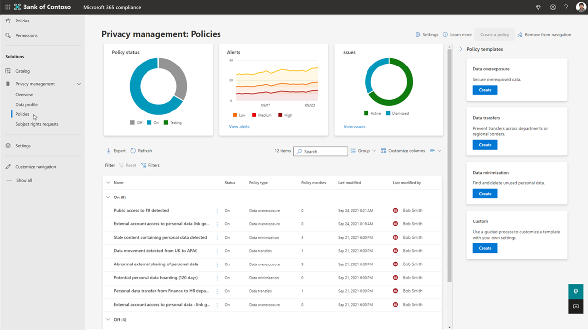

# Playbook d'essai : Microsoft Priva

Bienvenue dans le playbook d’essai Microsoft Priva.

Ce playbook vous aidera à tirer le meilleur parti de votre version d’évaluation gratuite de 90 jours en vous aidant à protéger vos données personnelles et à créer un espace de travail résilient à la confidentialité.

À l’aide des recommandations de Microsoft, vous allez découvrir comment Priva pouvez vous aider à identifier et à protéger de manière proactive contre les risques de confidentialité tels que l’accumulation de données, les transferts de données et le surpartage des données, aider votre organisation à automatiser et à gérer les demandes de sujet à grande échelle, et à permettre à vos employés de prendre des décisions intelligentes en matière de gestion des données.

## Prise en main

*Ces actions sont des recommandations sur les principales fonctionnalités à essayer dans votre version d’évaluation de 90 jours.*

Démarrez votre version d’évaluation en configurant les prérequis. Notez que Priva se compose de deux solutions clés, Gestion des risques de confidentialité Priva et Demandes de droits des personnes concernées Priva, qui peuvent être essayées et achetées séparément. Vous trouverez des détails sur les licences et les achats sur [Microsoft.com](https://www.microsoft.com/security/business/privacy/privacy-management-software?rtc=1#office-ContentAreaHeadingTemplate-8x0pmkp).

### Gestion des risques liés à la confidentialité

Avec la solution **Gestion des risques** liés à la confidentialité, vous pouvez découvrir comment protéger les données personnelles de votre organisation et créer un espace de travail résilient à la confidentialité.

- Identifier et protéger de manière proactive contre les risques de confidentialité tels que la thésaurisation des données, les transferts de données et le surpartage des données
- Obtenir une visibilité sur le stockage et le déplacement des données personnelles
- Permettre aux travailleurs de l’information de prendre des décisions intelligentes concernant la gestion de ces données
- Permettre aux utilisateurs de gérer efficacement les données et de prendre des mesures pour se conformer à l’évolution des réglementations en matière de confidentialité

### Demandes de droits de personnes concernées

Avec la solution **Demandes de droits** d’objet, vous pouvez apprendre à gérer les demandes à partir de la demande initiale jusqu’à la production de rapports.

- Gérer les demandes de droits d’objet à grande échelle

## Démarrer votre essai Microsoft Priva

Si vous êtes prêt à commencer à utiliser Microsoft Priva, suivez ces étapes pour configurer les prérequis et commencer à explorer les insights de confidentialité.

1. [Confirmer les abonnements et les licences](priva-setup.md#confirm-subscriptions-and-licensing)
1. [Définir les autorisations utilisateur et attribuer des rôles](priva-setup.md#set-user-permissions-and-assign-roles)
1. Sélectionnez « Démarrer la version d’évaluation » pour effectuer les opérations suivantes :
    - Priva licences d’évaluation sont activées (cela se produit en temps réel)
    - Des insights sur la confidentialité sont générés (cela prend 24 heures)

## Commencer à rechercher et à visualiser les risques liés à la confidentialité

Priva vous aide à comprendre les données stockées par votre organisation en automatisant la découverte des ressources de données personnelles et en fournissant des visualisations d’informations essentielles.

Pour commencer, accédez à la section Priva du [portail de conformité Microsoft Purview](https://compliance.microsoft.com/) et affichez les pages suivantes :

1. [Vue d’ensemble](priva-data-profile.md#explore-the-overview-page) : fournit une vue agrégée de votre posture de confidentialité, notamment le volume, la catégorie, l’emplacement et le déplacement des données personnelles dans votre environnement Microsoft 365. En outre, vous bénéficiez d’une visibilité sur l’état actuel et les tendances des risques de confidentialité associés découlant du surpropriété, du transfert ou de l’utilisation des données personnelles.
1. [Profil de données](priva-data-profile.md#explore-the-data-profile-page) : fournit une capture instantanée des données personnelles que votre organisation stocke dans Microsoft 365, y compris le volume, le type et l’emplacement (stockage et géographie).

## En savoir plus sur les stratégies

La gestion des risques liés à la confidentialité vous permet de configurer des stratégies qui identifient les risques de confidentialité dans votre environnement Microsoft 365 et facilitent la correction.

1. [En savoir plus sur les principaux scénarios de risque](risk-management.md#learn-about-key-risk-scenarios)
1. [Limiter la surexposition des données](risk-management.md#limit-data-overexposure)
1. [Rechercher et atténuer les transferts de données](risk-management.md#find-and-mitigate-data-transfers)
1. [Réduire les données stockées](risk-management.md#minimize-stored-data)

## Créer et personnaliser des stratégies

Créez de nouvelles stratégies dans La gestion des risques liés à la confidentialité pour traiter les scénarios de risque de confidentialité importants pour votre organisation. Pour un démarrage rapide, utilisez les paramètres par défaut du modèle pour créer de nouvelles stratégies pour la surexposition des données, les transferts de données, la réduction des données et les scénarios.

1. [Créer une stratégie à l’aide d’un modèle avec les paramètres par défaut](risk-management-policies.md#quick-setup-using-a-template-with-default-settings)
1. [Créer une stratégie en personnalisant les paramètres du modèle](risk-management-policies.md#custom-setup-guided-process-to-choose-all-settings)
1. [En savoir plus sur les paramètres clés pour toutes les stratégies](risk-management-policies.md)
1. [En savoir plus sur les paramètres des stratégies de minimisation des données](risk-management-policy-data-minimization.md)
1. [En savoir plus sur les paramètres des stratégies de transfert de données](risk-management-policy-data-transfer.md)
1. [En savoir plus sur les paramètres des stratégies de surexposition des données](risk-management-policy-data-overexposure.md)

## Gérer les stratégies 

Une fois que vous avez créé des stratégies dans Privacy Risk Management pour gérer les scénarios de minimisation des données, de transfert de données ou de surexposition des données, vous souhaiterez peut-être examiner ou mettre à jour vos paramètres de stratégie. Vous souhaiterez peut-être également tester une nouvelle stratégie avant de la déployer entièrement pour une utilisation continue.

1. [Afficher les détails de la stratégie](risk-management-policies-manage.md#view-details-and-activity-from-the-policy-details-page)
1. [Tester votre stratégie](risk-management-policies-manage.md#testing-a-policy)
1. [Suppression d’une stratégie](risk-management-policies-manage.md#delete-a-policy)

## Comprendre les alertes et les problèmes de stratégie

L’examen des alertes vous permet d’identifier les cas qui nécessitent un suivi. Pour ce faire, vous pouvez créer des problèmes qui permettent à vos utilisateurs de passer en revue le contenu de manière structurée, d’affecter la gravité du problème et de travailler en collaboration pour résoudre les problèmes.

1. [Afficher les alertes et les problèmes actuels](risk-management-alerts.md#view-current-alerts-and-issues)
1. [Gérer des alertes](risk-management-alerts.md#manage-alerts)
1. [Gérer les problèmes](risk-management-alerts.md#manage-issues)
1. [Examiner le contenu et corriger les problèmes](risk-management-alerts.md#review-content-and-remediate-issues)

## Envoyer des notifications de stratégie aux utilisateurs

La gestion des risques liés à la confidentialité peut informer directement les propriétaires de contenu des correspondances pour votre surexposition des données, la réduction des données et les stratégies de transfert de données. Avec les notifications par e-mail, vos utilisateurs peuvent facilement en savoir plus sur le contenu qu’ils doivent examiner.

1. [Préparer le contenu de la formation pour les notifications de stratégie](risk-management-notifications.md#prepare-training-content-for-notifications)
1. [Configurer des notifications par e-mail pour les stratégies](risk-management-notifications.md#set-user-email-notifications)
1. [Afficher un aperçu et personnaliser les notifications par e-mail](risk-management-notifications.md#preview-and-customize-email-content)
1. [Envoyer des notifications dans Teams](risk-management-notifications.md#send-notifications-in-teams)

## En savoir plus sur les demandes de droits de personnes concernées

Conformément à certaines réglementations en matière de confidentialité dans le monde entier, les personnes (ou les personnes concernées) peuvent faire des demandes pour examiner ou gérer les données personnelles sur elles-mêmes collectées par les entreprises. Ces demandes sont parfois également appelées demandes d’objet de données (DSR), demandes d’accès de la personne aux données (DSAR) ou demandes de droits du consommateur. Demandes de droits des personnes concernées Priva pouvez vous aider à gérer ces demandes.

1. [Créer des demandes et collecter des données](subject-rights-requests-create.md)
1. [Correspondance des données](subject-rights-requests-data-match.md)
1. [Examiner les données et collaborer sur les demandes](subject-rights-requests-data-review.md)
1. [Répondre aux demandes](subject-rights-requests-reports.md)
1. [Automatiser les tâches](subject-rights-requests-automate.md)

## Créer des demandes de droits d’objet

Les administrateurs de gestion des droits de l’objet peuvent ouvrir de nouvelles demandes de droits d’objet via la page principale demandes de droits d’objet. Un Assistant vous guide tout au long du processus de recherche de données personnelles sur un sujet de données et de démarrage du processus de traitement de leur demande.

1. [Utiliser l’Assistant Demande de droits d’objet](subject-rights-requests-create.md#use-the-subject-rights-request-creation-wizard) : créer une demande
1. [Définir les paramètres de recherche](subject-rights-requests-create.md#define-search-settings)
1. [Affiner les paramètres de recherche](subject-rights-requests-create.md#refine-your-search)

## Gérer la correspondance des données pour les demandes de droits d’objet

Avec la correspondance des données, les organisations peuvent permettre à Priva d’identifier les personnes concernées en fonction des valeurs de données exactes fournies.

1. [Préparer l’importation de données](subject-rights-requests-data-match.md#prepare-for-data-import)
1. [Définir le schéma de données personnelles](subject-rights-requests-data-match.md#define-the-personal-data-schema)
1. [Télécharger données personnelles](subject-rights-requests-data-match.md#upload-personal-data)

## Passer en revue les données et collaborer sur les demandes de droits d’objet

Après avoir créé une demande de droits d’objet, Priva utiliserez vos entrées sur votre sujet pour rechercher des correspondances dans l’environnement Microsoft 365 de votre organisation. Une fois que ces données ont été compilées, vous pouvez examiner les résultats, faire des choix sur ce qu’il faut inclure et répéter des informations si nécessaire.

1. [Examiner les détails de la demande et surveiller la progression](subject-rights-requests-data-review.md#step-1-review-request-details-and-monitor-progress)
1. [Afficher et modifier des requêtes de recherche](subject-rights-requests-data-review.md#step-2-optional-view-and-edit-search-queries)  (facultatif)
1. [Passer en revue les données](subject-rights-requests-data-review.md#step-3-review-data)
1. [Fermer la demande](subject-rights-requests-data-review.md#step-4-close-the-request)

## Gérer les rapports des demandes de droits d’objet et traiter les demandes

Après avoir effectué votre examen des données pour une demande de droits d’objet, vous pouvez passer à la demande de traitement.

1. [Préparer les rapports finaux pour la personne concernée](subject-rights-requests-reports.md)
1. [Intégrer avec des solutions partenaires](subject-rights-requests-reports.md#integrate-with-partner-solutions)
1. [Gérer la rétention des données](subject-rights-requests-reports.md#retention-periods-for-reports-and-data)

## Automatiser les tâches de demandes de droits d’objet

Activez Power Automate flux pour Priva afin d’automatiser les tâches importantes pour les cas et les utilisateurs, telles que la création de tickets dans ServiceNow ou l’ajout de rappels de calendrier sur les dates d’échéance.

1. [Créer un flux de Power Automate à partir d’un modèle](subject-rights-requests-automate.md#create-a-new-power-automate-flow-from-a-template)
1. [Partager un flux de Power Automate](subject-rights-requests-automate.md#share-a-power-automate-flow)
1. [Modifier ou supprimer Power Automate flux](subject-rights-requests-automate.md#edit-or-delete-power-automate-flow)

## Ressources supplémentaires

**Microsoft Docs** : Obtenez des informations détaillées sur le fonctionnement de Microsoft Priva et sur la meilleure façon de l’implémenter pour votre organisation. [Visitez Docs](priva-overview.md).

**Pourquoi Microsoft Priva** : en savoir plus sur les fonctionnalités de Priva dans cette [vidéo](https://www.youtube.com/watch?v=6OLky1biPIQ).

**En savoir plus sur Microsoft Priva** : blogs, plans, tarification [ici](https://aka.ms/privacymgmt/web).

**Microsoft Priva d’achat** : les demandes de gestion des risques de confidentialité et de droits des personnes concernées sont vendues séparément. Vous trouverez des détails sur les licences et les achats sur [Microsoft.com](https://www.microsoft.com/en-us/security/business/privacy/privacy-management-software?rtc=1#office-ContentAreaHeadingTemplate-8x0pmkp).
